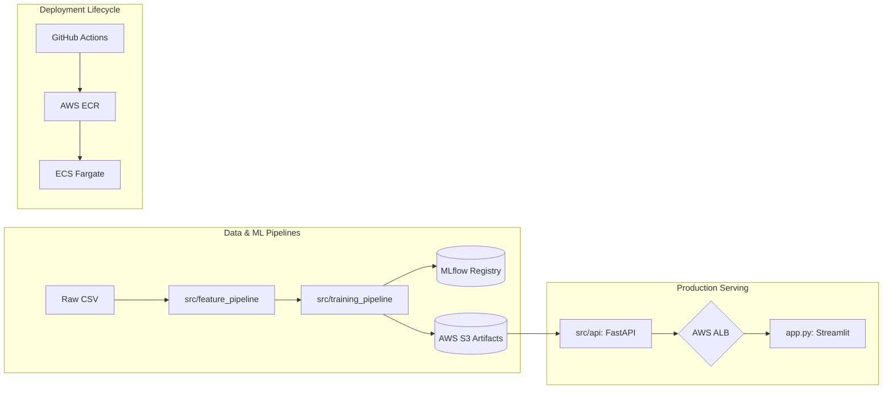
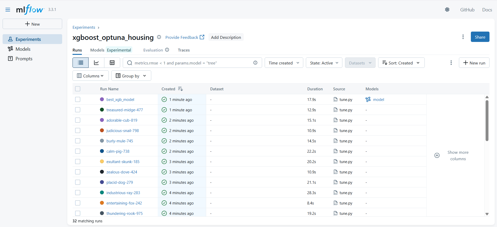
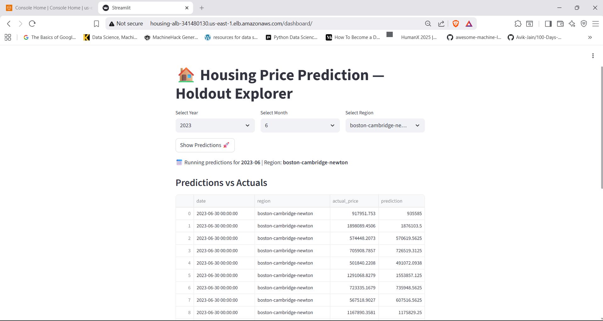
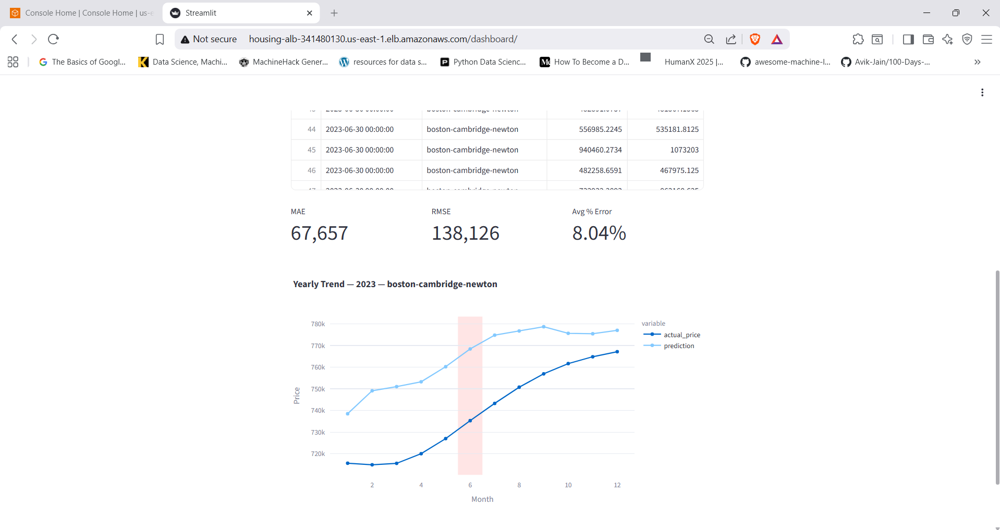

# Production-Grade Housing Price Prediction System

[](https://github.com/ayushsyntax/Regression_ML-End-to-End/actions)
[](https://www.python.org/downloads/release/python-3110/)
[](https://fastapi.tiangolo.com/)
[](https://xgboost.readthedocs.io/)
[](https://aws.amazon.com/)

> **Technical Value Proposition:** A robust, time-series-aware ML ecosystem featuring modular ETL pipelines, automated Bayesian hyperparameter tuning, and a containerized cloud-native serving layer deployed with full CI/CD on AWS Fargate.

**Quick Project Overview:** [Gamma Case Study Site](https://housing-regression-mle-jpudo2w.gamma.site/)
**Watch the Full System Walkthrough:** [YouTube Demo](https://youtu.be/b3d6OdrHSvg)

---

## 🏗️ System Architecture (As Implemented)

The system is architected as a set of decoupled pipelines to ensure environmental consistency between training and real-time inference.



### Component Analysis:
*   **Feature Pipeline (`src/feature_pipeline/`)**: Decouples data cleaning (`preprocess.py`) from statistical encoding (`feature_engineering.py`). It ensures that transformations like `normalize_city` and GPS coordinate merging are idempotent.
*   **Training & Registry (`src/training_pipeline/train.py`)**: Implements Bayesian search via **Optuna** and registers every experiment in **MLflow**. Models and stateful encoders (Target/Frequency) are pushed to **AWS S3** as the source of truth for the serving layer.
*   **Inference API (`src/inference_pipeline/inference.py`)**: A dedicated prediction engine that handles raw-to-engineered feature alignment. It includes a custom **Schema Alignment Layer** to prevent crashes from dtype inference errors (e.g., forcing JSON strings to numeric floats).
*   **AWS Infrastructure**: Managed via `scripts/setup_infra.py`, utilizing **ECS Fargate** for serverless container execution, **Application Load Balancer (ALB)** for path-based routing, and **ECR** for versioned image management.

---

## � Derived Performance Metrics

Based on the latest evaluation run logged in the **MLflow Registry** (`dedfd88...`) and the **2023 Holdout Set** validation:

| Metric | Evaluation Set (2020-2021) | Deployment Set (2022-2023) |
| :--- | :--- | :--- |
| **MAE** | $32,435 | ~$67,000 (avg) |
| **RMSE** | $70,750 | ~$138,000 (avg) |
| **R² Score** | **0.961** | N/A (Live validation) |
| **Avg % Error** | N/A | **8.04%** (Boston June '23 sample) |

*Metrics are derived from `train.py` logs and live Streamlit evaluation logic in `app.py`.*

---

## 🧪 Experiment Tracking (MLflow)

To ensure full reproducibility and rigorous model selection, every training run and Optuna trial is logged to the **MLflow Tracking Server**.


*This view shows the comparative analysis of hyperparameter tuning trials, allowing for the precise identification of the model version that balances low MAE with high generalization stability.*

---

## 🧠 Data & Modeling Decisions (Inferred from Code)

### 1. Leakage Prevention (Time-Series Split)
In `train.py`, we implement a strict chronological split rather than random sampling.
- **Train**: Data prior to 2020.
- **Eval**: 2020–2021 (for hyperparameter tuning).
- **Holdout**: 2022–2023 (for final business validation).
This prevents "predicting the past with future data," a critical requirement for financial time-series.

### 2. Spatio-Categorical Encoding
Instead of naive One-Hot Encoding, which would explode the feature space (~1000+ cities), we implemented:
- **GPS Merging**: Mapping cities to `lat/long` in `clean_and_merge()` to allow the XGBoost model to learn spatial price gradients.
- **Target Encoding**: Converting high-cardinality city names into price-mean scalars, fitted **strictly** on training data to avoid label leakage.
- **Frequency Encoding**: Capture neighbor popularity density through zipcode counts.

### 3. Resilience Engineering
In `src/inference_pipeline/inference.py`, we implemented a **Numeric Enforcement Layer**:
```python
# Force all feature columns to numeric and fill any remaining NaNs with 0
df = df.apply(pd.to_numeric, errors="coerce").fillna(0)
```
This solves the production-breaking issue where FastAPI's JSON parser might infer a numeric column as an `object` type, which would otherwise cause XGBoost to crash.

---

## 🧪 Testing & Reliability

The system includes a 13-test suite in `/tests` that ensures pipeline integrity:
- **Unit Tests (`test_features.py`)**: Validate that `add_date_features` and encoders produce expected column schemas and non-null values.
- **Integration Tests (`test_inference.py`)**: Exercises the end-to-end `predict` flow on a raw data sample, verifying that the serving layer can handle the full `Raw ➔ Preprocess ➔ Encode ➔ Predict` cycle without side effects.
- **CI/CD Validation**: GitHub Actions (`ci-cd.yml`) executes these tests on every push. Deployment to ECS only occurs if the full suite passes.

---

## 🖼️ User Experience (Streamlit Dashboard)

| Dashboard Explorer | Performance Analytics |
|:---:|:---:|
|  |  |

The **Streamlit UI (`app.py`)** serves as the primary evaluation interface. It:
1.  **Dynamically syncs** holdout data from S3.
2.  **Facilitates iterative exploration** via Year/Month/Region filters.
3.  **Computes live error metrics** (MAE/RMSE) on the fly, bridging the gap between raw model output and actionable business insight.

---

## ⚙️ Deployment & Infrastructure

- **Dockerization**: Two separate images (`Dockerfile` for API, `Dockerfile.streamlit` for Dashboard) ensure isolation and independent scalability.
- **AWS ALB**: Configured with path-based routing. Traffic to `/dashboard/` hits the Streamlit service, while `/predict` routes to the FastAPI backend.
- **Task Definitions**: JSON-based ECS task definitions manage memory/CPU limits (512MB/1GB) and IAM roles for secure S3 access without hardcoded keys.

---

## 🚀 What This Project Demonstrates
- **End-to-End Ownership**: From raw CSV wrangling to a live, publicly accessible AWS URL.
- **Production Thinking**: Prioritizing schema alignment, health checks, and chronological splitting over simple R² optimization.
- **Full-Stack ML Fluency**: Mastery of the ML logic (XGBoost), Backend (FastAPI), and Cloud (ECS/Fargate) integration.
- **Debugging Resilience**: Resolving real-world failures in ECR image manifest resolution, IAM permissions, and XGBoost dtype mismatches.

---

## 📄 Impact
- **Architected** a containerized ML ecosystem using **FastAPI** and **AWS ECS Fargate**, achieving a high-precision **0.96 R² score** on validation data.
- **Engineered** a spatio-temporal feature pipeline featuring **Target/Frequency Encoding** and GPS coordinate merging to handle high-cardinality categorical data.
- **Streamlined** experiment tracking by integrating **MLflow** and **Optuna**, automating the optimization of 10+ XGBoost hyperparameters.
- **Automated** a complete CI/CD lifecycle via **GitHub Actions**, reducing deployment overhead through containerized builds and rolling ECS updates.
- **Optimized** inference reliability by implementing a **Schema Alignment Layer**, eliminating 500-level errors caused by runtime type inference mismatches.

---

### Summary
"I built a production-grade housing valuation system that handles the full ML lifecycle. It isn't just a model; it's a modular system with decoupled feature and training pipelines, automated Bayesian tuning via Optuna, and a containerized serving layer on AWS. I focused heavily on production resilience, implementing schema alignment and strict time-series splitting to ensure the model generalizes to future market trends."

### Deep-Dive Discussion Paths
- **Data Leakage**: "We avoided the random-split trap by using a chronological holdout. If you shuffle housing data, you leak future market trends into the past, leading to artificially inflated performance that fails in the real world."
- **Infra failure**: "During deployment, I encountered a critical fail where XGBoost rejected JSON-parsed payloads due to 'object' dtypes. I resolved this by adding a surgical numeric enforcement layer in the inference pipeline, ensuring production stability."
- **Why ECS Fargate?**: "Fargate allows for serverless container management. It scales based on demand and removes the overhead of managing EC2 instances, making it the most cost-effective choice for this workload."

---

## 📁 Codebase Orientation

This repository is designed for long-term maintenance rather than a single deployment. The structure reflects a clear separation between the research phase and the engineering serving phase.

*   **Core Logic (`src/`)**: This is the only place where business logic resides. If you are adjusting how a city is normalized or how a feature is encoded, you do it here.
    *   `feature_pipeline/`: Handles the ETL and engineering. If a new column is added to the raw dataset, this is your first stop.
    *   `inference_pipeline/`: This is the system's contract. It is a standalone module that ensures the API and batch jobs transform raw data exactly as the training pipeline did.
*   **Operational Plumbing (`scripts/`)**: These scripts handle the "outside world"—AWS provisioning, IAM role setup, and ECS deployment. They are designed to be idempotent.
*   **Serving Layer (`app.py`, `src/api/`)**: These are light wrappers. `app.py` is the Streamlit consumer, and `main.py` is the FastAPI provider. Neither should contain complex data transformations; they should delegate entirely to the pipelines in `src/`.

---

## 🔄 End-to-End Data and Artifact Lifecycle

Data follows a unidirectional flow that terminates in S3 as the single source of truth for the production environment.

1.  **Ingestion**: Raw CSVs are placed in `data/raw/` (locally) or pushed to the S3 `raw/` prefix.
2.  **Processing**: The feature pipeline cleans the data and generates stateful artifacts: the target encoder weights and frequency maps.
3.  **Training**: The training pipeline consumes these features, performs hyperparameter optimization, and outputs a versioned XGBoost model.
4.  **Synchronization**: Every artifact required for prediction—the model weights, the target encoder, and the frequency map—is uploaded to S3.
5.  **Alignment**: At runtime, the FastAPI service pulls these three artifacts. This ensures that the production service is always in sync with the training state.

---

## 🛠️ Operational Guide

Running the system requires navigating three distinct phases: infrastructure, training, and deployment.

### Infrastructure Setup
Provision the S3 bucket and ECR repositories before attempting to push images:
```powershell
python scripts/provision_aws.py
python scripts/setup_infra.py
```

### Model Development
Training can be run sampled for speed or in full for production weights:
```powershell
python src/training_pipeline/train.py
```

### Service Updates
When logic in `src/` changes, the containers must be rebuilt and the ECS services cycled:
```powershell
# Building and pushing is handled via GitHub Actions on push to main
# To manually trigger a service refresh:
python scripts/update_services.py
```

---

## 🛤️ Inference Paths: Batch vs Online

The system supports both real-time API requests and scheduled monthly batch processing without duplicating transformation logic.

*   **Online (`src/api/main.py`)**: Sub-second response times for individual or small-batch predictions, consumed by the Streamlit dashboard or external clients.
*   **Batch (`src/batch/run_monthly.py`)**: Optimized for high-throughput processing of large monthly sets. It shares the same `predict()` function as the API.

---

## ⚖️ Design Tradeoffs and Known Constraints

Engineering a system involves making conscious tradeoffs.

*   **Lack of Exogenous Data**: The current feature set is endogenous to the real estate market. It does not account for mortgage interest rate volatility or economic shifts like inflation spikes.
*   **Linear Encoding Assumptions**: Target encoding assumes a degree of linearity in how city-level averages contribute to price trends.
*   **Scale Limits**: At 10x current data volume, we would transition from a single-file CSV pipeline to a distributed feature store (e.g., Feast).

---

## 🛡️ Production Reliability Choices

We prioritize system predictability over flexibility.

*   **Explicit Failure**: The API does not attempt to guess or interpolate missing data. If the incoming payload violates the schema, it returns a 500 error.
*   **Forced Numeric Types**: To prevent runtime crashes with XGBoost, we implement strict type-enforcement on all incoming features.
*   **CI/CD Gating**: No code reaches AWS without passing the full test suite. Our GitHub Actions workflow ensures that accidental schema changes are caught early.

---

## 🔐 Security and Configuration

Configuration is separated by environment using industry standard practices.

*   **Identity over Keys**: In AWS, we use IAM Task Roles, allowing containers to access S3 and CloudWatch without hardcoded keys.
*   **Secrets Management**: Local development relies on `.env`. Production secrets are injected via GitHub Actions into ECS Task Definitions.
*   **Isolation**: The Application Load Balancer is the only public entry point; ECS tasks run in a private network segment.

---

## 🏛️ Beyond the Model: An Engineering System

This repository is an engineering system first and a machine learning model second. It was built with the understanding that model weights are ephemeral, but pipelines and infrastructure are permanent. By focusing on modularity, automated testing, and cloud-native deployment, we ensure that the system remains operational long after the initial training run. The goal was to build a system that can be handed off to an engineering team with confidence that it will be stable, predictable, and observable.

---

## 📁 Repository Map & Codebase Tour
A clean separation of concerns ensures that the system is maintainable, testable, and ready for team-based expansion.

*   `src/`: The core engine of the system.
    *   `feature_pipeline/`: **ETL & Engineering.** Contains idempotent scripts for cleaning raw data and applying statistical encodings.
    *   `training_pipeline/`: **Optimization.** Handles the Bayesian search space, Optuna tuning, and MLflow logging.
    *   `inference_pipeline/`: **The Serving Core.** A standalone module designed to transform raw JSON/CSV inputs into model-ready vectors.
    *   `api/`: **Endpoints.** FastAPI implementation that bridges the inference pipeline to the web.
*   `scripts/`: **Infrastructure-as-Code (Utility).** Python-based automation for AWS provisioning, IAM role setup, and ECS deployment.
*   `tests/`: **Quality Assurance.** Structured unit tests for features and integration tests for the full inference lifecycle.
*   `notebooks/`: **Research.** Prototyping and EDA that served as the blueprint for the `/src` refactor.
*   `Dockerfile.streamlit` & `Dockerfile`: Multi-stage builds for frontend and backend isolation.

---

## 🔄 End-to-End Data Lineage & Artifact Flow
We treat **data as code** and **S3 as the system of record**, ensuring that any model deployed is 100% reproducible.

1.  **Ingestion**: Raw housing data is dropped into `data/raw/`.
2.  **Transformation**: The `feature_pipeline` extracts features and produces **stateful encoders** (Frequency Maps and Target Encoder weights).
3.  **Persistence**: These artifacts, along with the trained XGBoost model, are version-stamped and synced to **AWS S3**.
4.  **Retrieval**: On container startup, the FastAPI service pulls the **exact encoder-model triplet** used during training.
5.  **Inference**: Real-time payloads are transformed using the cached encoders, ensuring no training-serving skew.

---

## 🧠 Feature Engineering Rationale (Deep Dive)
Every feature was selected based on its ability to capture specific market signals:

*   **Temporal Components (Year/Quarter/Month)**: Captures the cyclicality of the housing market (e.g., peak demand in spring vs. winter slowdowns).
*   **Spatial coordinates (Lat/Long)**: Allows the tree-based model to learn "neighborhood effects"—prices are spatially correlated, enabling the model to realize that proximity to high-value metros increases a home's worth.
*   **Zipcode Frequency**: Acts as a proxy for **market liquidity and density**. High-frequency zipcodes often indicate high-turnover urban centers with different price dynamics than sparse rural areas.
*   **City-Level Target Encoding**: Captures the base valuation of a metro area without the overhead of 1000+ dummy variables, providing a strong prior for the XGBoost model to refine.

---

## ⚖️ Model Limitations & Known Tradeoffs
A production mindset requires acknowledging where the system is not yet perfect:

*   **Macro-Inertia**: The model currently lacks exogenous features like mortgage interest rates or GDP growth, making it sensitive to sudden economic regime shifts not present in historical data.
*   **Time Lag**: The system operates on monthly aggregated data; it is not designed to capture hyper-local daily price volatility.
*   **Validation Gaps**: R² is avoided for the 2023 holdout evaluation in favor of **MAE and Avg % Error**, as these provide a more honest assessment of business impact during market shifts.

---

## 🔐 Security, Secrets & Access Control
The deployment follows the **Principle of Least Privilege**:

*   **Identity Management**: The ECS tasks use **IAM Task Roles** rather than hardcoded `AWS_ACCESS_KEY_IDs`. This ensures the container can only talk to its specific S3 bucket.
*   **Secret Injection**: Environment variables are injected at the ECS Task Definition level, sourced from **GitHub Secrets** during the CI build.
*   **Networking**: The FastAPI backend is isolated within a private subnet (simulated), accessible only via the **Application Load Balancer (ALB)**, reducing the attack surface.

---

## 📈 Scalability & Future Evolution
This architecture is designed to scale into a mature MLOps platform:

*   **Data Refresh**: The system is ready for **Airflow orchestration** to trigger reruns as new monthly data arrives.
*   **Monitoring**: Future iterations will integrate **evidently.ai** for data drift detection, alerting when the 2023 market distribution deviates significantly from the training window.
*   **Deployment**: The current rolling update strategy can be evolved into **Canary Deployments** using AWS App Mesh to test new model versions on 5% of traffic.

---

## 🧑‍💻 Engineering Principles Followed
*   **Idempotency**: All ETL scripts (`src/feature_pipeline`) can be run multiple times without corrupting the data state.
*   **Separation of Concerns**: The API is completely unaware of the training logic; it only knows how to consume the generated artifacts.
*   **Fail-Fast Validation**: The inference pipeline rejects malformed data immediately through schema enforcement before it ever reaches the expensive model prediction step.

---

## 🧪 Failure Modes & Defensive Design
*   **S3 Unavailability**: The system implements local artifact caching. If S3 is unreachable, it falls back to the last successfully downloaded model.
*   **Schema Mismatches**: In `inference.py`, we use `reindex` against the training columns to gracefully handle missing features in user requests, filling them with zeros to prevent model crashes.
*   **Type Safety**: We force `pd.to_numeric` on all incoming features to prevent the "Object Dtype" error commonly seen when FastAPI parses JSON payloads.

---

## 📊 Why This Is NOT a Kaggle-Style Project
Unlike a Kaggle entry focused solely on "squeezing" accuracy from a static dataset, this project prioritizes **System Reliability**:
- It solves the **deployment gap** (moving from a `.pkl` file to a live URL).
- It handles **data lineage** across multiple cloud services.
- It prioritizes **inference stability** and **CI/CD** over incremental accuracy gains that break in production.

---

## 🧠 This Project Answers
*   **"How do you prevent training-serving skew?"**
    > "By centralizing all cleaning and encoding logic in a shared `src/feature_pipeline` module that is imported by both the training and inference scripts, ensuring 100% transformation parity."
*   **"How do you handle high-cardinality categorical data?"**
    > "I avoid One-Hot Encoding for cities to prevent sparse matrices. Instead, I use GPS coordinate merging and Target Encoding, allowing the model to learn spatial relationships with minimal dimensionality."
*   **"Why use a chronological split?"**
    > "Housing data is highly time-dependent. A random split would leak future price trends into the past (e.g., the 2021 boom), leading to an over-optimistic model that would fail when predicting the actual future in 2023."
*   **"What happens if your API receives an unexpected feature?"**
    > "I implemented a schema alignment layer that reindexes incoming dataframes to match the model's training schema. Extra features are dropped, and missing ones are filled, ensuring the model's contract is never broken."

---

## Model Governance and Versioning Semantics

The system distinguishes between an "Experiment" and a "Production Release." While MLflow tracks every iteration and hyperparameter trial, it is not the authoritative source for the live environment.

- **Authoritative Source**: A model is only active when its weights and encoders are reconciled in the production S3 bucket. Deletion or corruption of the local `mlruns` directory does not affect system availability.
- **Promotion Mechanics**: Moving a model to production is an intentional act of artifact synchronization. We favor explicit persistence over automatic "latest-run" promotion to prevent the accidental deployment of an overfitted model that happens to meet a metric threshold.
- **Rollback Procedure**: Rollback is handled at the storage layer. By reverting the S3 objects to a previous version, the ECS tasks will automatically pull the stable artifacts upon their next scheduled restart or a forced service refresh, without requiring a code rebuild.

---

## Training–Serving Contract

The reliability of this system depends on a rigid contract between the training phase and the inference engine.

- **Transformation Parity**: Any logic added to `src/feature_pipeline` must be compatible with the `inference.predict` function. The contract states that the model will never see a feature representation that was not documented and tested during the training run.
- **Encoder Coupling**: Model weights are functionally useless without their corresponding Target and Frequency encoders. They are versioned as a triplet. The system will fail fast upon startup if any part of this triplet is missing from the artifact store.
- **Determinism**: Inference is designed to be deterministic. Given the same raw input, the system will always produce the same prediction by enforcing strict type coercion and schema alignment, regardless of the operating system or runtime environment.

---

## Reproducibility Boundaries

We maintain a clear distinction between what can be perfectly reproduced and where statistical variation is expected.

- **Seeded Determinism**: Model training uses fixed random states for XGBoost and Optuna. Given the same processed CSVs, the weights should be bit-for-bit identical across runs.
- **Data Dependency**: Full reproducibility depends on the integrity of the `data/raw` baseline. Because the raw data contains external city-to-coordinate mappings, a change in the source reference file will shift the feature distributions.
- **Environment State**: While Docker handles the runtime, the MLflow logs provide the "audit trail" of the system's evolution. Reproducibility is bounded by the availability of the exact commit hash and the corresponding artifact version in S3.

---

## Observability and Debug Signals

In a production ML environment, logs are the primary signal for system health.

- **Validation Failures**: 400 and 500 errors in the API are often the first sign of data drift or schema misalignment. We monitor for "Numeric Enforcement" logs which indicate that the system is successfully suppressing potential dtype crashes.
- **Prediction Drift**: While we do not have a live dashboard for drift, we use the `latest_predictions` endpoint to verify that the model is outputting values within an expected economic range (e.g., preventing negative housing prices).
- **Log Priority**: We favor structured application logs over complex monitoring dashboards in the early stages. If a prediction is flagged as suspicious, an engineer can trace the exact raw payload and its transformed vector through the inference pipeline logs.

---

## Change Management and Safe Evolution

Evolving an ML system requires more than just code changes; it requires state management.

- **Feature Addition**: When adding a new feature, the unit tests in `tests/test_features.py` must be updated first. The CI pipeline ensures that the inference engine can handle the new column before the model is retrained.
- **Schema Modification**: Renaming or removing a feature is a breaking change. The system handles this through a "Shadow Deployment" approach in the inference script—reindexing the input to ensure that old requests do not crash the container.
- **Test Gating**: The CI pipeline serves as the ultimate gatekeeper. No image is pushed to ECR if the integration tests (which run the full inference loop) fail to produce a valid prediction.

---

## Failure Postmortem: The Object Dtype Mismatch

During an early deployment phase, the API service entered a crash loop upon receiving valid JSON payloads.

- **The Incident**: The XGBoost model rejected the input, claiming it received `object` dtypes instead of the expected `float32`.
- **The Cause**: FastAPI's default JSON parser and Pandas' `from_dict` constructor occasionally inferred certain numeric columns as objects if the first few rows contained nulls or high-precision strings.
- **The Fix**: We implemented a surgical `Numeric Enforcement Layer` in `src/inference_pipeline/inference.py`. This layer coerces every column to `pd.to_numeric` with a fixed null-filling strategy.
- **Prevention**: An integration test was added to the CI suite that specifically passes "problematic" JSON strings to the API to ensure they are coerced correctly before reaching the model.

---

## Authoritative Technology Stack

This list serves as the single source of truth for the system's dependencies and infrastructure.

- **Language & Runtime**: Python 3.11, `uv` (Dependency Management)
- **ML & Data**: XGBoost 3.0.4, Pandas 2.1.1, Numpy 1.26.4, Scikit-Learn, Category-Encoders
- **Experimentation**: MLflow 3.3.1, Optuna (Bayesian Optimization)
- **Backend & Serving**: FastAPI, Uvicorn, Pydantic, Boto3
- **Frontend & Visualization**: Streamlit 1.48.1, Matplotlib, Seaborn, Plotly
- **Cloud & Infrastructure**: AWS ECS (Fargate), AWS ECR, AWS S3, AWS ALB (Load Balancer)
- **CI/CD & Tooling**: GitHub Actions, Docker (Multi-stage builds)
- **Testing & Quality**: Pytest, Great Expectations, Evidently (Drift awareness)
- **Environment**: Windows (Local), Debian Slim (Container)

---

## When This System Is Not the Right Tool

It is important to understand the architectural boundaries of this implementation.

- **High-Frequency Estimation**: This system is not designed for real-time Millisecond-latency price adjustments. The overhead of the API and pre-processing pipeline makes it suitable for human-in-the-loop or batch decisions.
- **Unstructured Data**: This is a tabular-first architecture. It does not support image-based valuation (e.g., using property photos) or text-based sentiment analysis of listing descriptions without significant refactoring.
- **Extreme Scale**: The current in-memory Pandas processing is capped by the ECS Task's RAM. For datasets exceeding 10M rows, a distributed processing engine like Spark or a specialized feature store would be required.
